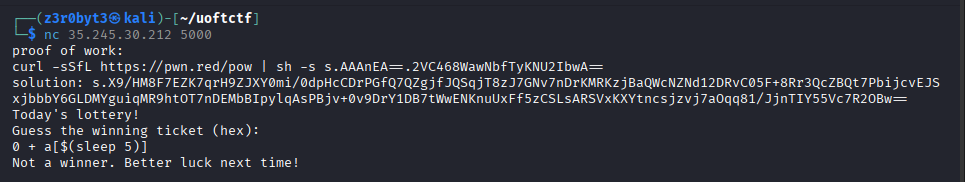
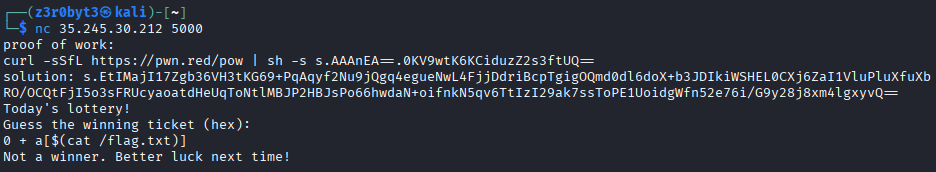
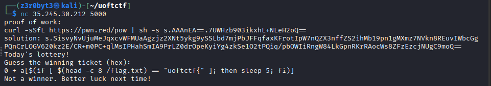
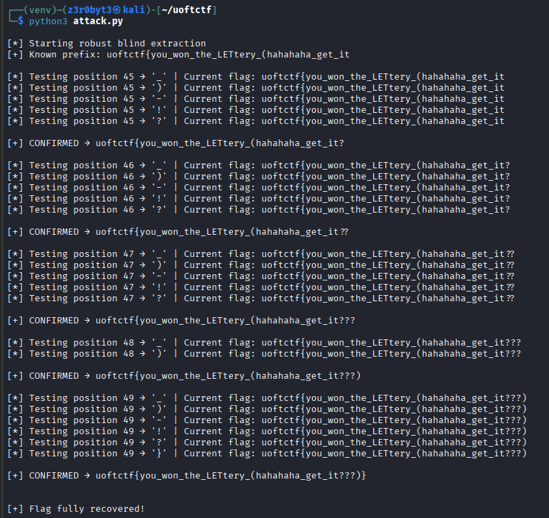

# Descrption:

Han Shangyan quietly gives away all his savings to protect someone he cares about, leaving himself with nothing. Now broke, his only hope is chance itself.

Can you help Han Shangyan win the lottery?

`nc 35.245.30.212 5000`

# Overview

The **nc service** runs a Bash script that reads user input and stores it in a variable called `guess`.  
There is a verification step that uses a **regex** to check whether the input is hexadecimal or not.

If the input passes the regex check, it is placed into another variable `g` in the following format:

    g=0x$guess

This converts the provided hex value into its **decimal equivalent**.

Next, the script generates a **16-byte random value**, computes its **MD5 hash**, takes the **first 16 characters** of that hash, and stores it in the variable `ticket`.  
That value is then converted again as:

    t=0x$ticket

To get the flag, our input must satisfy the condition:

    if [[ $g -eq $t ]]

Which basically means **our input must exactly match a randomly generated MD5-based value**.  
Yeah… that’s clearly **impossible** in a normal way.

---

# Important note:

Whoever wants to know very **detailed implementation** of my solution read this, others can find the **simplified solution** at last part of this file.

## The Real Vulnerability

The **only loophole** in this script is the **regex validation**.

The regex **only checks whether the input starts with a hex value**, but it does **not validate the remaining part** of the input.

That means inputs like the following are accepted:

    0 + t
    0 $(whoami)
    0 anything_you_want

And that’s where the exploitation begins 

---

# Solution

## Command Injection 

My first idea was **command injection** by escaping **double quotes**.

### Payload Used

    0" ; cat /flag.txt ;"

My thought process was that the script would become something like:

    let "g = 0x0" ; cat /flag.txt ; ""

...and boom, the flag should be printed.

But nope...That didn’t work.

### Why It Failed

Bash executes commands **line by line**, and when `let` is executed, it already knows where the quotes start and end.  
So the entire arithmetic expression is treated as **one command**, and the injected commands are never executed.

So yeah… **this attempt failed**.

---

## Arithmetic Expansion Injection

Then my teammate noticed something interesting 

The script allows **arithmetic expressions**, which means we can abuse **arithmetic expansion**.

### Payload Used

    0 + a[$(sleep 5)]

Boom!! The script responded **5 seconds later**.

### What Happened?

Inside the `let` command:

- Bash tries to evaluate the arithmetic expression
- It encounters `a[$(sleep 5)]`
- The command inside `$(...)` gets executed during evaluation

That confirmed **command execution is possible** 

---

### Trying to Read the Flag

So naturally, I tried:

    0 + a[$(cat /flag.txt)]

But this turned out to be useless.

Why?

Because the command does execute, but the output gets stored internally as an array index:

    a[uoftctf{something}]

Here there is **no way to print that value** back to the terminal.

So… another dead end.

---

## Time-Based Side Channel Attack

Once again, my teammate came to the rescue

Instead of trying to **print** the flag, we decided to **leak it using response time**.

### Payload Used

    0 + a[$(if [ $(head -c 1 /flag.txt) == "u" ]; then sleep 3; fi)]

Boom!! The script responded **3 seconds later**.

### What This Means

- If the condition is true → script sleeps
- If false → instant response

So now we can **guess the flag character by character** by monitoring the response time ⏱️

---

## Finding the Flag Length

Before brute-forcing characters, we first needed the **flag length**.

### Payload Used

    0 + a[$(if [ $(wc -c < /flag.txt) -eq 49 ]; then sleep 3; fi)]

It worked ...The script responded after 3 seconds.

So the **flag length is 49 characters**.

Removing the known prefix and braces:

    uoftctf{} → 9 characters
    49 − 9 = 40 remaining characters

---

## Bruteforce Strategy

Character set used:

- a–z
- A–Z
- 0–9
- Special characters like `_-?!()`

That’s roughly **65 characters**.

Total attempts:

    65 × 40 = 2600

At ~10 seconds per attempt…  
Yeah, that’s **around 7 hours** 

---

## What I did

### Step 1: Confirm Known Prefix

    0 + a[$(if [ $(head -c 8 /flag.txt) == "uoftctf{" ]; then sleep 3; fi)]

Positive response  
So I directly started from the **9th character**.

---

### Step 2: Smart Character Sets

I started with this set:

    _-?!abcdefghijklmnopqrstuvwxyzABCDEFGHIJKLMNOPQRSTUVWXYZ0123456789

After ~15 minutes, I got:

    uoftctf{you_w

At this point, patience was running low

So I manually tested:

    0 + a[$(if [ $(head -c 20 /flag.txt) == "uoftctf{you_won_the_" ]; then sleep 3; fi)]

Boom!! That jump alone saved me **around 1 hour**.

---

### Step 3: Parallel Scripts

I ran **two scripts simultaneously**:
- One for lowercase
- One for uppercase

Within ~10 minutes, I got:

    uoftctf{you_won_the_LET

Then I kept syncing both scripts whenever one found a new character.

---

### Step 4: Special Characters & Final Push

Eventually, I reached:

    uoftctf{you_won_the_LETtery_

No results → added more special characters.

Then I hit:

    (

And later:

    uoftctf{you_won_the_LETtery_(hahahaha

After letting the scripts finish, the final flag was revealed.

---

# Final Flag 

    uoftctf{you_won_the_LETtery_(hahahaha_get_it???)}

# Simpleified Solution:

The `nc` script uses a weak regex that only verifies whether the input **starts** with a hex character.  
Because of this, arbitrary arithmetic expressions are accepted.

The input is later evaluated using `let`, which allows **arithmetic expansion**.  
This enables command execution inside expressions such as:

    0 + a[$(command)]

My solution uses a **time-based side-channel**:
- The script sleeps when a guessed prefix is correct
- It responds instantly when the guess is wrong

By measuring response time, the flag can be extracted **character by character**.

To speed up extraction:
- Known prefixes (`uoftctf{`) were verified first
- Longer prefixes were tested to skip positions
- Multiple scripts were run in parallel with different character sets

Final flag recovered:

    uoftctf{you_won_the_LETtery_(hahahaha_get_it???)}

