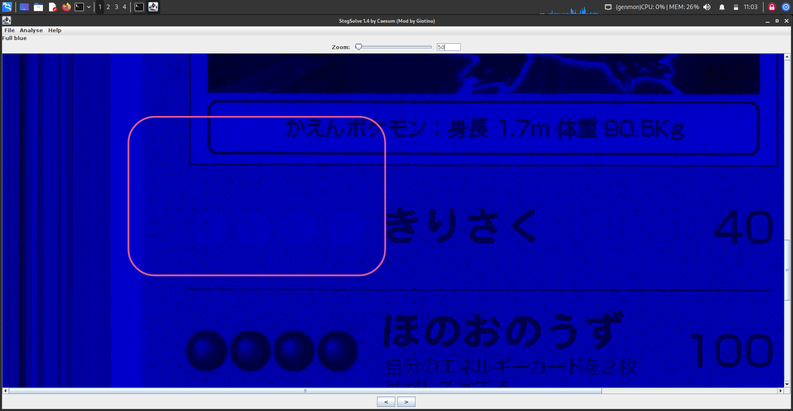
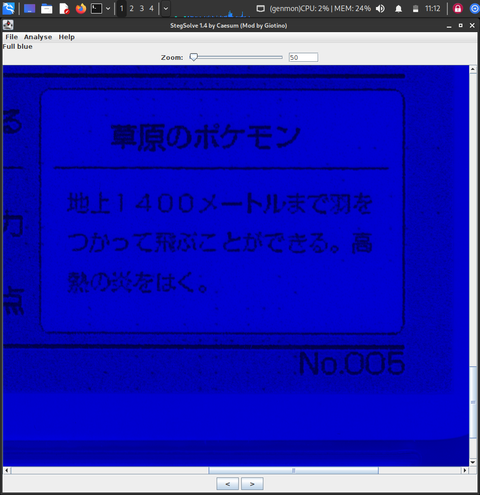
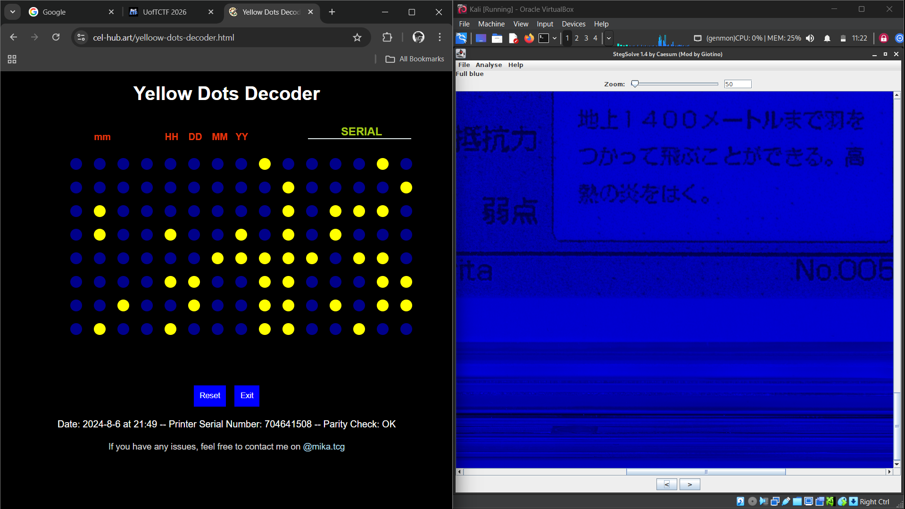
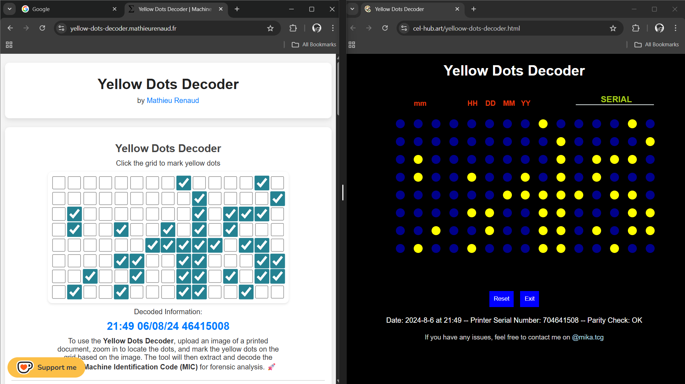

# Description

Han Shangyan noticed that recently, Tong Nian has been getting into Pokemon cards. So, what could be a better present than a literal prototype for the original Charizard? Not only that, it has been authenticated and graded a PRISTINE GEM MINT 10 by CGC!!!

Han Shangyan was able to talk the seller down to a modest 6-7 figure sum (not kidding btw), but when he got home, he had an uneasy feeling for some reason. Can you help him uncover the secrets that lie behind these cards?

What you will need to find:

Date and time (relative to the printer, and 24-hour clock) that it was printed.

Printer's serial number.

The flag format will be uoftctf{YYYY_MM_DD_HH:MM_SERIALNUM}

Example: uoftctf{9999_09_09_23:59_676767676}

# Overview

We were given a **soft copy of a rare CGC-certified Charizard Pokémon card** as the challenge file.  
The task was to find:

-  The **date and time** the card was printed  
-  The **printer’s serial number**

Although the card is claimed to be original, modern color printers can easily produce prints that look almost identical to real Pokémon cards. With the naked eye, it’s nearly impossible to tell whether the card is genuine or printed.

So instead of trusting how it looks, we had to look for what the printer leaves behind.

---

# Solution

## Yellow Dots - The Printer’s Hidden Signature

Most modern color printers secretly add an **8×15 grid of tiny yellow dots** to every printed page.  
These dots are almost invisible to the naked eye but contain important information such as:

- The **date and time** of printing  
- The **printer’s serial number**

This is commonly known as a **Machine Identification Code (MIC)**.

The goal of this challenge was simple:  
**find the yellow dot grid and decode it.**

---

## Step 1️⃣: Revealing the Yellow Dots

To make the yellow dots visible, the image needs some preprocessing.

I used **StegSolve** for this.

1. Open the task image in **StegSolve**
2. At the bottom of the window, you’ll see two arrow buttons that let you cycle through different filters

3. Click the **left arrow** until you reach the **Full Blue** filter
4. Zoom into the image

After applying the filter, small dot patterns start to appear across the image.

The yellow dot grid appears in multiple places. Choose the one that is the **clearest and easiest to read**.

I selected the grid located at the **bottom-right corner** of the image.

---

## Step 2️⃣: Decoding the Dot Grid

Once the grid is clearly visible, the next step is decoding it.

You can use the following online decoder:

https://cel-hub.art/yelloow-dots-decoder.html

1. Open the site  
2. Carefully recreate the dot grid exactly as seen in the image  
3. Submit the grid

The decoder will reveal:

- The **date and time** the card was printed  
- The **printer’s serial number**

---

## And finally we got the Flaaaaggg !!!

# Note

At starting I used this site : https://yellow-dots-decoder.mathieurenaud.fr
I don't know why, but this tool given me wrong serial number.

And one more important thing, **only color printers can print this yellow dots** , you can't find this in B&W prints...
